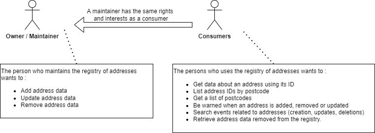

# Belgian addresses on blockchain
A smart contract which shows how blockchain can be leveraged to bring open data about addresses one step further.

### Data source

Open data about belgian addresses can be found on the [SPF BOSA site](https://opendata.bosa.be/index.fr.html).

### Principles

- The application provides a decentralized registry for belgian addresses.
- The maintainer of the registry can add, remove and update addresses.
- The consumers can use the registry as a trustable data source for belgian addresses
- When addresses are added, removed or updated, actionable events are be emitted to allow consumers to react.
- Addresses removed from the registry remain accessible in the history of data.
- Consumers are be able to query the full data history and registry in a easy way.

### Personnas

Two personnas are defined for the application :

- The maintainer, who deploys the smart contract and manages the addresses.
- Consumers, who use the functionalities provided by the smart contract to use the blockchain as a database and as an event publishing system for events related to address management (insertions, deletions & updates)



### Use cases & requirements

- [Add an address](./documentation/add_address.md)
- [Remove an address](./documentation/rm_address.md)
- [Update an address](./documentation/upd_address.md)
- [Search addresses](./documentation/search_address.md)

### Data model

Address data model :

```
struct StreetAddress { 
    bytes32 addressId;
    string streetName;
    string postcode;
    string houseNumber;
    string boxNumber;
    string latitude;
    string longitude;
}
```

### Data structures

Three data structures are managed by the contract :
- A map which uses the address ID as key and the address as value
- A map which uses the postcode as key and a list of all ids of addresses related to that postcode as value
- A list of all postcodes which have addresses in the registry

### Test it

[Remix](https://remix.ethereum.org/) is a browser based IDE where you can develop and test the smart contract.

1. Create the file for the smart contract and copy paste the code from addresses.sol


2. Save & compile the smart contract


3. Deploy the smart contract


4. Play !


You can add addresses, update and remove them. You can use different wallets to test permissions. Browse 
